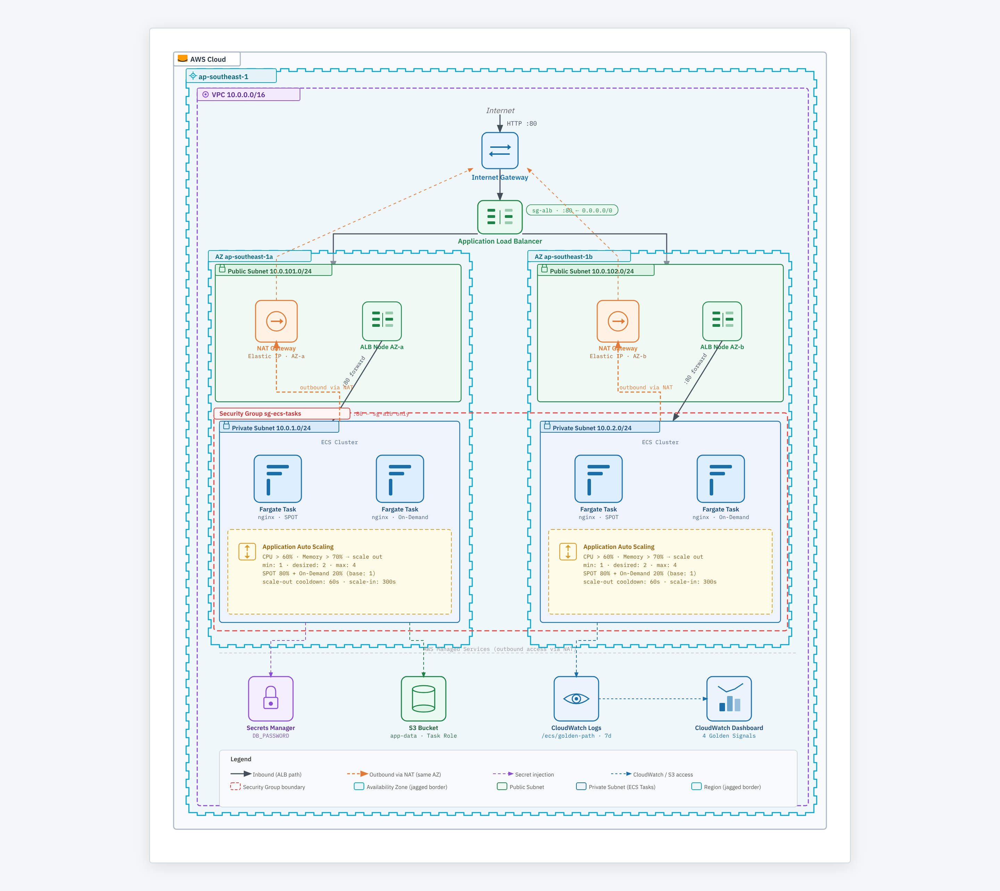

#  Golden Path — ECS Fargate Platform

A complete "Golden Path" for deploying microservices to AWS using ECS Fargate.
Covers all requirements: networking, compute, security, secrets, CI/CD, auto scaling, and observability.

---



GitHub Actions:
push to main
   → terraform plan
   → terraform apply
   → ecs update-service
   → ecs wait stable

---

## Project Structure

```
golden-path/
├── bootstrap/              # Step 0: Creates S3 + DynamoDB for Terraform state
│   └── main.tf
│
├── modules/
│   ├── networking/         # VPC, subnets, NAT GW, IGW, VPC endpoints
│   ├── ecs/                # Cluster, Task Def, Service, ALB, Auto Scaling
│   ├── iam/                # Task Execution Role + Task Role (ECS equiv. of IRSA)
│   ├── secrets/            # Secrets Manager secret + version
│   └── observability/      # CloudWatch Dashboard + Alarms (4 Golden Signals)
│
├── .github/workflows/
│   └── deploy.yml          # CI/CD: Plan → Apply → ECS Deploy
|   └── destroy.yml         # CI/CD: Added to destroy resources to avoid costing   
│
├── backend.tf              # Remote state config (update after bootstrap)
├── provider.tf             # AWS provider + Terraform version
├── variables.tf            # All input variables with defaults
├── main.tf                 # Root module wiring everything together
├── outputs.tf              # Key outputs (ALB URL, cluster name, etc.)
└── terraform.tfvars.example
```

---

## Quick Start

### Prerequisites

- AWS CLI configured (`aws configure` or environment variables)
- Terraform >= 1.6.0
- An AWS account (free tier eligible)

### Step 1 — Bootstrap Remote State

```bash
cd bootstrap/
terraform init
terraform apply

# Copy the "backend_config_snippet" output into ../backend.tf
```

### Step 2 — Deploy Infrastructure

```bash
cd ..  # back to project root

# Update backend.tf with the S3 bucket name from Step 1 output
# Then copy the example vars:
cp terraform.tfvars.example terraform.tfvars

# Init with remote backend
terraform init

# Preview changes
terraform plan

# Deploy everything
terraform apply
```

### Step 3 — Verify

```bash
# Get the ALB URL
terraform output alb_url

# Open in browser — you should see the nginx welcome page
curl $(terraform output -raw alb_url)

# View the CloudWatch Dashboard
terraform output cloudwatch_dashboard_url
```

---

## Design Decisions

### Why ECS Fargate over EKS?

| Concern | ECS Fargate | EKS |
|---|---|---|
| **Cluster cost** | FREE | ~$0.10/hr ($73/mo) mandatory |
| **Complexity** | Low — AWS-native | High — K8s expertise needed |
| **Multi-cloud** | AWS-only | Multi-cloud possible |
| **Operational overhead** | Near-zero | Significant (upgrades, add-ons) |
| **Free tier fit** | ✅ Yes | ❌ No (EKS control plane always billed) |

For a purely AWS workload, ECS Fargate gives you the same core capabilities (auto scaling, load balancing, service discovery, secret injection, IAM roles) without the EKS control plane cost or operational complexity.

### Spot + On-Demand Fallback

The ECS service uses a **mixed capacity provider strategy**:

```hcl
# 80% FARGATE_SPOT (up to 70% cheaper)
capacity_provider_strategy {
  capacity_provider = "FARGATE_SPOT"
  weight            = 4
  base              = 0
}

# 20% FARGATE On-Demand (guaranteed capacity, always-on baseline)
capacity_provider_strategy {
  capacity_provider = "FARGATE"
  weight            = 1
  base              = 1  # ← Always keep at least 1 On-Demand task
}
```

ECS automatically handles Spot interruption by replacing terminated tasks. The `base=1` on FARGATE ensures at least one On-Demand task is always running for reliability even during Spot shortages.

**Kubernetes equivalent:** Node groups with mixed instance policy (Spot + OD) + Cluster Autoscaler.

### ECS Task Role = IRSA Equivalent 

| Kubernetes IRSA | ECS Task Role |
|---|---|
| OIDC provider in IAM | IAM Trust Policy for `ecs-tasks.amazonaws.com` |
| Service Account annotation | `taskRoleArn` in Task Definition |
| Pod gets JWT from K8s API | Task gets temp creds from ECS metadata endpoint |
| SDK auto-discovers creds | SDK auto-discovers creds (same credential chain) |
| No static access keys | No static access keys |

The app running inside the ECS container calls S3 using standard AWS SDK with **zero configuration** — credentials are automatically provided by the ECS task metadata endpoint and rotated by AWS every few hours.

### Secret Injection

The ECS-native approach replaces External Secrets Operator or the Secrets Store CSI Driver:

```
Secrets Manager → ECS Execution Role reads at task start → Injected as DB_PASSWORD env var
```

```hcl
# In Task Definition
secrets = [
  {
    name      = "DB_PASSWORD"
    valueFrom = "arn:aws:secretsmanager:us-east-1:123:secret:golden-path/dev/db-password"
  }
]
```

The application reads `process.env.DB_PASSWORD` (or `os.environ['DB_PASSWORD']`) — no AWS SDK calls, no secret management code in the app.

To rotate: `aws secretsmanager put-secret-value --secret-id golden-path/dev/db-password --secret-string 'newpass'` then force a new ECS deployment.

### Auto Scaling (= K8s HPA)

```
CloudWatch metric: ECSServiceAverageCPUUtilization
  ↓ > 60% for 60 seconds
Application Auto Scaling increases DesiredCount
  ↓ New Fargate tasks launched (Spot preferred)
  ↓ ALB automatically routes traffic to new tasks
  
CPU drops below 60% for 300 seconds
  ↓ Application Auto Scaling decreases DesiredCount
```

### 4 Golden Signals Dashboard

| Signal | Source Metric | Dashboard Panel |
|---|---|---|
| **Latency** | `ALB TargetResponseTime` | p50 / p95 / p99 line chart |
| **Traffic** | `ALB RequestCount` | Requests/min time series |
| **Errors** | `ALB HTTPCode_Target_5XX_Count` | 4xx + 5xx counts |
| **Saturation** | `ECS CPUUtilization` + `MemoryUtilization` | % utilization with scale-out threshold annotations |


---

## Rotating the DB Password

```bash
# Update the secret value
aws secretsmanager put-secret-value \
  --secret-id "golden-path/dev/db-password" \
  --secret-string "my-new-secure-password"

# Force ECS to restart tasks with the new secret
aws ecs update-service \
  --cluster golden-path-dev-cluster \
  --service golden-path-dev-hello-world-svc \
  --force-new-deployment
```

---

| Secret | Value |
|---|---|
| `AWS_ROLE_ARN` | ARN of the OIDC-federated IAM role |
| `AWS_REGION` | `us-east-1` |
| `TF_STATE_BUCKET` | S3 bucket name from bootstrap output |
| `TF_STATE_DYNAMODB` | DynamoDB table name from bootstrap output |
| `ECS_CLUSTER_NAME` | From `terraform output ecs_cluster_name` |
| `ECS_SERVICE_NAME` | From `terraform output ecs_service_name` |
